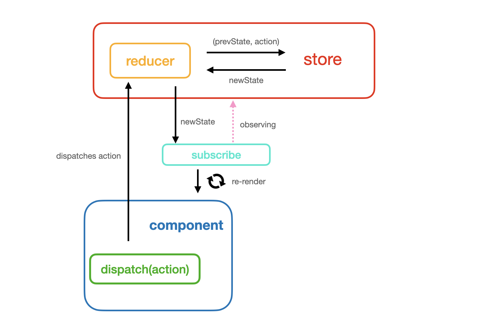
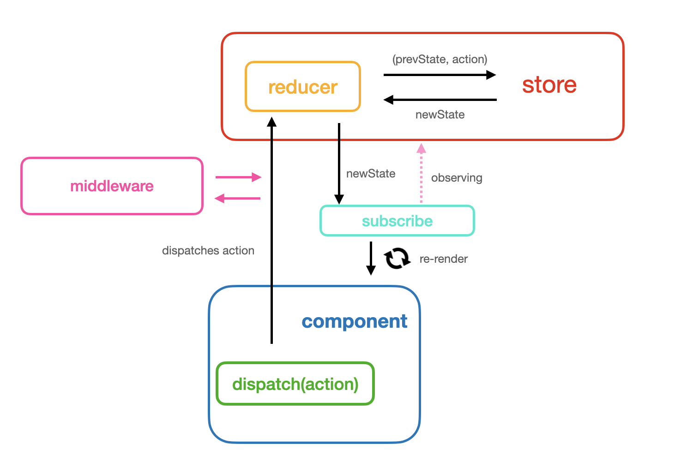
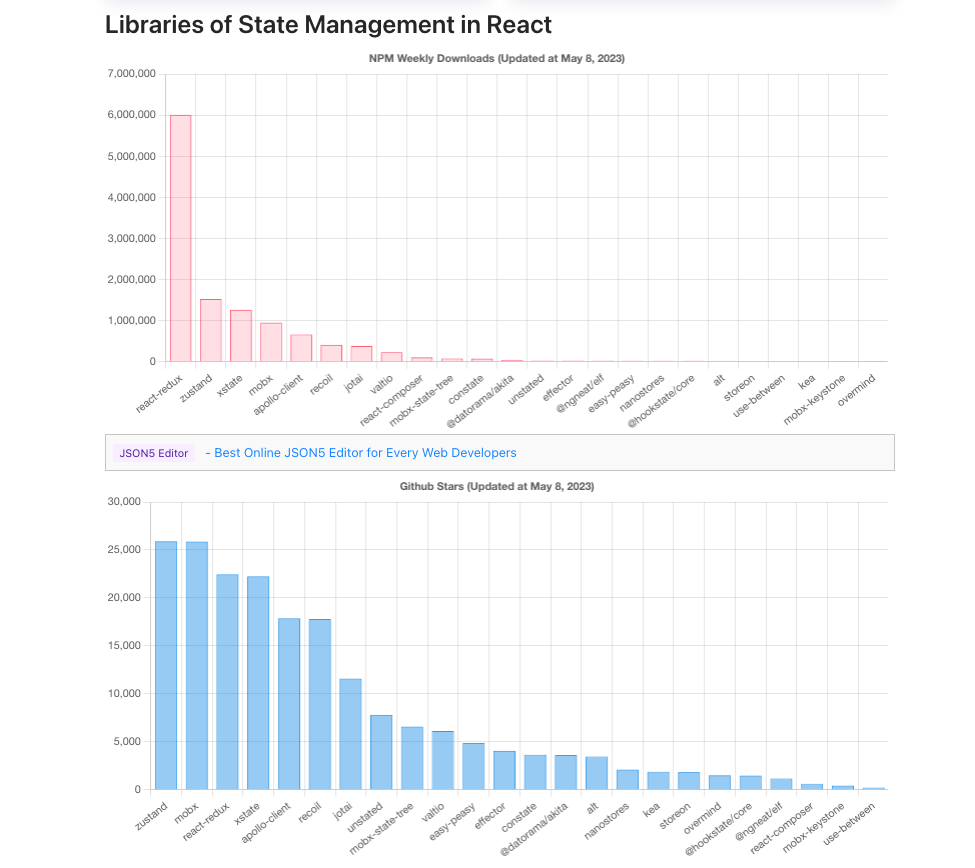

# State Managements

> 다양한 상태 관리 라이브러리에 대해서 알아보자.

## Intro

장문 주의 😅

프런트엔드의 리액트 생태계의 폭발적인 성장으로 컴퍼넌트 중심의 앱 개발을 기본으로 하고 있다. 그 컴퍼넌트 사이에 인터렉션을 위해서 존재하는 것이 상태(state)이고 이것을 관리하기 위한 라이브러리 역시 리액트의 성장과 맞물려 다양하게 등장하고 있다. 그렇다면 왜 상태 관리해야만 할까? 나 역시 처음 리액트를 배울 때, 기본적인 컴퍼넌트 내부의 state와 컴퍼넌트 간의 전달을 위한 props로서만 앱을 구성하였었다. 그때 당시는 그것만으로도 어느 정도 만족할만한 앱을 구현할 수 있었다. 시간이 지나면서 규모가 큰 프로젝트를 만나면서 이것만으로는 컴퍼넌트 간의 상태를 관리하는 것이 버거워짐을 느낄 수 있었다. 컴퍼넌트의 depth가 깊어짐에 따라서 자식 컴퍼넌트로 몇 번의 반복을 통해서 상태를 전달해야만 하는 불편함, 서로 다른 컴퍼넌트 간의 상태 전달을 위한 복잡한 로직, 그로 인한 디버깅의 어려움, 단순한 기능 한 개의 추가가 너무 많은 로직을 수정해야만 하는 어려움 등등 많은 부분들에서 어려움을 느꼈다. 이러한 어려움을 해소 하기 위해서 `Redux`, `MobX`, `Recoil` 등의 다양한 라이브러리들이 등장하였고, 나는 이 중에서 Redux를 사용하였다. 사실 내가 라이브러리를 선택하여 설계한 것이 아니라 이미 존재하던 프로젝트에서 개발이 진행되던 터라 어떤 상태 관리 라이브러리가 더 좋은지 혹은 더 알맞은지에 대한 이해는 없었다. 하지만 Redux을 지속해서 사용하다 보면 '굳이 기능 하나 추가에 생각보다 많은 양의 코드를 넣어야 하는 걸까' 라는 의문을 품기도 했다. 그러나 상태 관리에 대해서 Redux 외에는 아는 것이 없었기 때문에 이에 대한 판단을 할 수 없었다. 그래서 해당 프로젝틀 시작하게 되었다. 이 프로젝트는 대단히 거창한 것은 아니다. 유명한 상태 관리 라이브러리에 대해서 알아보고, 이해하기 쉬운 간단한 미니 프로젝트(?)를 통해서 **각각의 장단을 이해해보는 시간**을 가질 것이다. 이러한 다양한 경험은 **적합한 라이브러리 선택의 기준**을 마련해 줄 수 있을 것이며, 나아가 다양하고 복잡한 상태 관리 라이브러리, 프런트엔드의 세계에서 `나만의 판단`을 만드는 좋은 밑거름이 되리라 생각한다.

## Redux [done]

> `1_redux` directory

> 리덕스의 전체적인 흐름을 다이어그램으로 알아보자 🚀

전체적인 흐름을 단계별로 이해해보자. 특정 컴퍼넌트의 상태를 변경시키는 과정이라고 가정해보자.

- 리덕스에서 상태를 변경시키기 위한 유일한 방법은 액션을 보내는 것이다. 그래서 컴퍼넌트에서 특정 상태에 대한 타입을 설정한 액션을 디스패치를 통해서 스토어로 보낸다. 즉, 디스패치는 상태 변화를 시작하는 트리거 역할을 한다.

- 스토어에서는 전달된 액션에 따라서 리듀서가 새로운 상태를 업데이트 한다.

- 컴퍼넌트는 서브스크라이브(이하 '구독')을 통해서 스토어의 상태변화를 감지할 수 있다. 만약 상태 변화가 일어난다면, 구독하고 있는 컴퍼넌트에서 새로운 상태를 반영하여 리랜더링이 이루어진다.

  > 구독의 과정을 좀 더 자세히 설명하면, 구독 함수는 리스너를 인자로 갖을 수 있다. 이 리스너 안에서는 스토어의 상태에 대해서 접근할 수 있다. 또한 리스너는 상태 변화가 생겼을 때 호출된다. 그렇기 때문에 리스너 안에는 상태 변화가 일어났을 때의 로직이 구현됨으로서 컴퍼넌트에서 새로운 상태에 대한 리랜더링이 나타날 수 있게 된다.

- 상태 변화가 일어날 때마다 항상 위와 같은 데이터의 단방향 흐름을 통해서 컴퍼넌트의 변화가 나타난다.

## React Redux [done]

> `2_react-redux` directory

리액트 리덕스가 무엇일까? 리덕스와 리액트 리덕스는 무엇이 다르길래 우리는 리덕스 뿐만 아니라 리액트 리덕스도 알아야할까?

### middleware

> 미들웨어는 리덕스 흐름상 어디에 위치하는지 다이어그램을 통해서 살펴보자.

## Redux Toolkit [done]

> `3_redux-toolkit` directory

> 리덕스 툴킷을 이용한 `CRUD Blog App` 🗒️

> [Demo](https://devdemodd.github.io/rtk-blog-app-v2/)

  
Features

- [x] apply redux-toolkit
- [x] posts CRUD
- mock server
  - [x] fake server 설정 : use json-server
  - [x] user : login/signup : use json-server-auth
- [x] CSS module system
- [x] apply concurrently

### Redux Toolkit API 정리

  
APIs

- [createAction](./docs/redux-toolkit-api.md#createAction)
- [createReducer](./docs/redux-toolkit-api.md#createReducer)
- [configureStore](./docs/redux-toolkit-api.md#configureStore)
- [createSlice](./docs/redux-toolkit-api.md#createSlice)

## Redux Saga [-ing]

> `4_redux-saga` directory

> rtk + rtk-query/redux-saga을 이용한 TodoApp + Pokemon Deck

정리

- generator란
  - https://www.zerocho.com/category/ECMAScript/post/579b34e3062e76a002648af5
  - https://kyounghwan01.github.io/blog/TS/React/redux-saga-ts/
    #package-json-%E1%84%89%E1%85%A5%E1%86%AF%E1%84%8E%E1%85%B5
- saga에서 genrator라는 개념을 어떻게 사용하는지
- redux saga pattern

  - https://ssangq.netlify.app/posts/redux-saga
  - https://meetup.toast.com/posts/136

- [리덕스 사가](https://mskims.github.io/redux-saga-in-korean/)에 대해서 알아보자

## MobX [-ing]

> `5_mobx` directory

> 간단한 카운터를 바닐라 자바스크립트와 MobX 조합으로 만들면서 MobX를 알아보자.

Redux 다음으로 알려진 상태관리 라이브러리는 `MobX`이다. (두번째라고 해서 두번째로 좋다는 건 아니다. 개발환경에 따라서 맞는 기술을 사용하면 되는 것!!)

## MobX React [done]

> `6_mobx-react` directory

> 리액트에서 MobX를 이용한 간단한 TodoApp을 통해서 리액트에서 MobX의 사용방법에 대해서 알아보자.

> [Demo](https://devdemodd.github.io/mobx-todoapp/)

  
Features

  
- [x] todo 아이템 추가
- [x] todo 아이템 수정
- [x] todo 아이템 삭제
- [ ] todo 아이템 필터링
- 유용한 통계 표시 구현
  - [x] 전체 todo 리스트에서 목록의 총 항목 수
  - [x] 완료된 항목 수
  - [ ] 완료된 항목의 백분율 같은 리스트의 유용한 속성들

## Recoil [done]

> `리액트` 전용 상태관리 라이브러리

> `Recoil`을 사용하여 간단한 **TodoApp** 을 만들어보기

> [Demo](https://devdemodd.github.io/recoil-todoapp/)

  
Features

  
- [x] todo 아이템 추가
- [x] todo 아이템 수정
- [x] todo 아이템 삭제
- [x] todo 아이템 필터링
- 유용한 통계 표시 구현
  - [x] 전체 todo 리스트에서 목록의 총 항목 수
  - [x] 완료된 항목 수
  - [x] 완료된 항목의 백분율 같은 리스트의 유용한 속성들

## More Learning 🚀

> 다양한 상태관리툴 경험해보기! (2023.05.08) 

- `zustand` & `xstate` 는 꼭 사용해보고 싶다.
- `mobX`는 뭔가 잘 사용하고 싶다. class를 사용해서 기존 코드스타일과 익숙하지 않고,OOP적인 느낌이 강해서 mobX를 잘하면 시야가 넓어질것 같은 느낌이 든다.)

---

# 참고자료

- 해당 프로젝트의 `모티브`를 제공한 강의

  - [📺 Redux vs MobX](https://www.inflearn.com/course/redux-mobx-%EC%83%81%ED%83%9C%EA%B4%80%EB%A6%AC-%EB%8F%84%EA%B5%AC)

- `상태 관리 툴` 세계의 큰 그림을 볼 수 있는 글

  - [🗒 2021년 React 상태 관리 라이브러리 전쟁](https://mmsesang.tistory.com/entry/2021%EB%85%84-React-%EC%83%81%ED%83%9C-%EA%B4%80%EB%A6%AC-%EB%9D%BC%EC%9D%B4%EB%B8%8C%EB%9F%AC%EB%A6%AC-%EC%A0%84%EC%9F%81-Hooks-Redux-Recoil)

  - [React State Management Libraries 2023](https://fe-tool.com/awesome-react-state-management)
